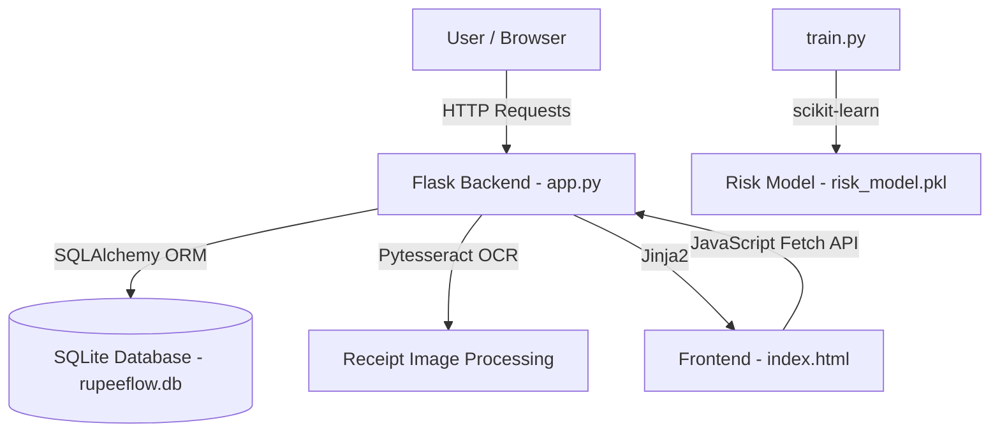
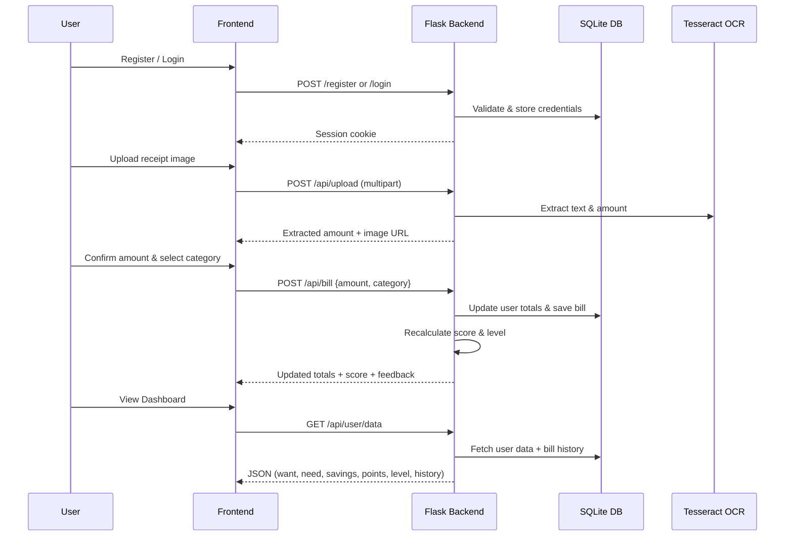

<p align="center">
  
</p>

# RupeeFlow — Smart Budget Tracker 🎯

## Basic Details

### Team Name: infinity

### Team Members
- Member 1: Lekshmy S R - College of Engineering attingal
- Member 2: Aswini S - College of Engineering attingal

### Hosted Project Link
https://lekshmy-sr.github.io/tink-her-hack-infinity/


https://drive.google.com/file/d/1UcPH-44lEBaZN33ef6N56JHVLuHA49Kz/view?usp=drivesdk

### Project Description
RupeeFlow is a gamified personal finance tracker that helps users manage their spending using the **50-30-20 budgeting rule** (50% Needs, 30% Wants, 20% Savings). It features receipt OCR scanning, a dynamic scoring & leveling system, and a sleek dark-themed dashboard to make budgeting engaging and fun.

### The Problem Statement
Many young adults struggle with budgeting and often overspend without realizing how their money is distributed across needs, wants, and savings. Traditional budgeting tools are boring and hard to stick with.

### The Solution
RupeeFlow gamifies the budgeting experience. Users log bills — either manually or by uploading receipt images (auto-extracted via OCR) — and categorize them as **Need**, **Want**, or **Save**. The app tracks spending proportions against the ideal 50-30-20 ratio, assigns a financial health **score** and **level**, and provides motivational feedback to encourage better habits.

---

## Technical Details

### Technologies/Components Used

**For Software:**
- **Languages used:** Python, HTML, CSS, JavaScript
- **Frameworks used:** Flask
- **Libraries used:** Flask-SQLAlchemy, Flask-CORS, Flask-Login, Werkzeug, Pytesseract (OCR), Pillow, scikit-learn, pandas, Gunicorn
- **Tools used:** VS Code, Git, SQLite

---

## Features

List the key features of your project:
- **Feature 1:** 🔐 **User Authentication** — Secure register/login system with hashed passwords and session-based auth.
- **Feature 2:** 📸 **Receipt OCR Upload** — Upload bill/receipt images and automatically extract the amount using Tesseract OCR.
- **Feature 3:** 📊 **50-30-20 Budget Tracking** — Categorize every expense as Need, Want or Save and track your spending ratios against the ideal split.
- **Feature 4:** 🏆 **Gamified Scoring & Levels** — Earn a financial health score (0–100) and level up as you maintain balanced budgets. Get motivational feedback on every transaction.
- **Feature 5:** 📜 **Bill History** — View a complete log of all past bills with date, category, amount, and attached receipt image.
- **Feature 6:** 🤖 **ML Risk Prediction** — A trained Random Forest model predicts financial risk based on spending patterns.

---

## Implementation

### For Software:

#### Installation
```bash
# Clone the repository
git clone https://github.com/Lekshmy-sr/tink-her-hack-infinity
cd tink-her-hack-infinity

# Create a virtual environment
python -m venv venv
source venv/bin/activate  # On Windows: venv\Scripts\activate

# Install dependencies
pip install -r requirements.txt
```

#### Run
```bash
python app.py
```
The app will start on `http://localhost:5000`.

---

## Project Documentation

### For Software:

#### Screenshots (Add at least 3)


#### Diagrams

**System Architecture:**



**Application Workflow:**



---

## Additional Documentation

### API Documentation

**Base URL:** `http://localhost:5000`

##### Endpoints

**POST /register**
- **Description:** Register a new user account.
- **Request Body:**
```json
{
  "username": "johndoe",
  "password": "securePassword123"
}
```
- **Response (201):**
```json
{
  "message": "User registered successfully"
}
```

---

**POST /login**
- **Description:** Log in with existing credentials. Sets a session cookie.
- **Request Body:**
```json
{
  "username": "johndoe",
  "password": "securePassword123"
}
```
- **Response (200):**
```json
{
  "message": "Logged in successfully",
  "username": "johndoe",
  "id": 1
}
```

---

**POST /logout**
- **Description:** Log out the current user and clear the session.
- **Response (200):**
```json
{
  "message": "Logged out successfully"
}
```

---

**GET /api/user/data**
- **Description:** Fetch the logged-in user's dashboard data including spending totals, score, level, and bill history.
- **Response (200):**
```json
{
  "username": "johndoe",
  "want": 3000,
  "need": 5000,
  "savings": 2000,
  "points": 85,
  "level": 6,
  "history": [
    {
      "id": 1,
      "amount": 500,
      "category": "need",
      "date": "21 Feb",
      "image_url": "/uploads/abc123_receipt.jpg"
    }
  ]
}
```

---

**POST /api/bill**
- **Description:** Add a new bill entry. Updates user spending totals and recalculates score & level.
- **Request Body:**
```json
{
  "amount": 500,
  "category": "need",
  "image_url": "/uploads/abc123_receipt.jpg"
}
```
- **Response (201):**
```json
{
  "message": "Bill added successfully",
  "bill_id": 5,
  "user_totals": {
    "want": 3000,
    "need": 5500,
    "savings": 2000,
    "points": 82,
    "level": 5,
    "feedback": "Nice! Your score improved. You're getting closer to the ideal 50-30-20 balance."
  }
}
```

---

**POST /api/upload**
- **Description:** Upload a receipt image. The server saves the file and attempts OCR extraction to find the bill amount.
- **Request:** `multipart/form-data` with a `file` field.
- **Response (200):**
```json
{
  "url": "/uploads/a1b2c3d4_receipt.jpg",
  "ocr_text": "Total: ₹1,250.00",
  "extracted_amount": 1250.0
}
```

---

## Project Demo

### Video
[Add your demo video link here - YouTube, Google Drive, etc.]

*Explain what the video demonstrates - key features, user flow, technical highlights*

### Additional Demos
[Add any extra demo materials/links - Live site, APK download, online demo, etc.]

---

## AI Tools Used (Optional - For Transparency Bonus)

If you used AI tools during development, document them here for transparency:

**Tool Used:** [e.g., GitHub Copilot, v0.dev, Cursor, ChatGPT, Claude]

**Purpose:** [What you used it for]
- Example: "Generated boilerplate React components"
- Example: "Debugging assistance for async functions"
- Example: "Code review and optimization suggestions"

**Key Prompts Used:**
- [Add your key prompts here]

**Percentage of AI-generated code:** [Approximately X%]

**Human Contributions:**
- Architecture design and planning
- Custom business logic implementation
- Integration and testing
- UI/UX design decisions

*Note: Proper documentation of AI usage demonstrates transparency and earns bonus points in evaluation!*

---

## Team Contributions

- [Name 1]: [Specific contributions - e.g., Frontend development, API integration, etc.]
- [Name 2]: [Specific contributions - e.g., Backend development, Database design, etc.]

---

## License

This project is licensed under the MIT License - see the [LICENSE](LICENSE) file for details.

---

Made with ❤️ at TinkerHub
